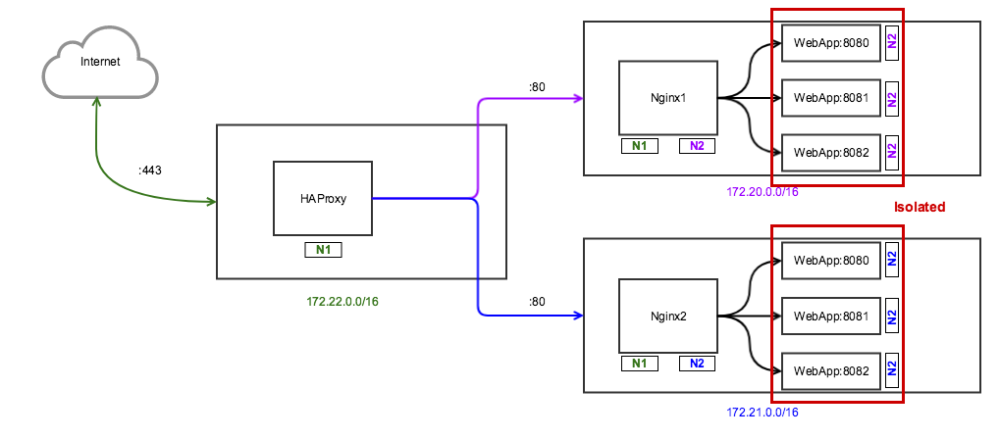

# [WIP]

This is a work in progress tutorial.

## Network Diagram

```

```

- The architecture has 3 different networks:
  - 172.22.0.0/16 [Bridge] network
  - 172.21.0.0/16 [Isolated] network — No ip masquerading
  - 172.20.0.0/16 [Isolated] network — No ip masquerading
- There are 3 different containers running:
  - HAProxy container x 1
  - NGINX container x 3
  - WebApp container x 6
- HAProxy:
  - The HAProxy is connected to 172.22.0.0/16 and loadbalances the traffic coming on port 443 and port 80 to the 2 NGINX containers running in the Isolated networks
- NGINX:
  - 1 NGINX instance is running on 172.22.0.0/16 and serves only purpose of accepting connections from lets-encrypt certbot whenever the SSL certificate needs to be renewed.
  - 2 NGINX instances running in Isolated networks (172.21.0.0/16, 172.20.0.0/16) working as reverse-proxy for the WebApps. These 2 instances are also connected to the Bridge network 172.22.0.0/16
- WebApps:
  - 6 Python WebApps running in Isolated networks (172.21.0.0/16 and 172.20.0.0/16). 3 instances run in each isolated network.

The main aim of this set up is to have the WebApps isolated from the internet. They should only be able to communicate for the services in their network.

> None of the containers are running on a full Linux system so manually configuring iptable rules can get tricky.

